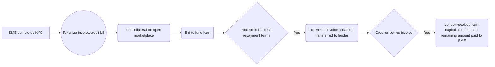

<a name="readme-top"></a>

[![Contributors][contributors-shield]][contributors-url]
[![Forks][forks-shield]][forks-url]
[![Stargazers][stars-shield]][stars-url]
[![Issues][issues-shield]][issues-url]
[![MIT License][license-shield]][license-url]
[![LinkedIn][linkedin-shield]][linkedin-url]


<!-- PROJECT LOGO -->
<br />
<div align="center">
  <a href="https://github.com/IKalonji/dotex">
    
  </a>

  <h3 align="center">DotEx</h3>

  <p align="center">
    Brand new DeFi primitive, DotEx turns you invoices and receivables into Tokenized assets, which can then be used as collateral against through P2P bid lending.
    <br />
    <a href="https://github.com/IKalonji/dotex"><strong>Explore the docs »</strong></a>
    <br />
    <br />
    <a href="url-here">View Demo</a>
    ·
    <a href="https://github.com/IKalonji/dotex/issues">Report Bug</a>
    ·
    <a href="https://github.com/IKalonji/dotex/issues">Request Feature</a>
  </p>
</div>


<!-- TABLE OF CONTENTS -->
<details>
  <summary>Table of Contents</summary>
  <ol>
    <li>
      <a href="#about-the-project">About The Project</a>
      <ul>
        <li><a href="#built-with">Built With</a></li>
      </ul>
    </li>
    <li>
      <a href="#getting-started">Getting Started</a>
      <ul>
        <li><a href="#prerequisites">Prerequisites</a></li>
        <li><a href="#installation">Installation</a></li>
      </ul>
    </li>
    <li><a href="#usage">Usage</a></li>
    <li><a href="#roadmap">Roadmap</a></li>
    <li><a href="#contributing">Contributing</a></li>
    <li><a href="#license">License</a></li>
    <li><a href="#contact">Contact</a></li>
    <li><a href="#acknowledgments">Acknowledgments</a></li>
  </ol>
</details>


<!-- ABOUT THE PROJECT -->
## About The Project

[![Product Name Screen Shot][product-screenshot]](./screenshots/home.png)

DotEx is a decentralized platform that provides Small to Medium size businesses (SME's) with short term liquidity through a new DeFi primitive of receivable invoice discounting. DotEx allows SME's to tokenize their outstanding invoices and use them as collateral for short term funding. The platform is fully peer to peer, allowing lenders to compete and provide competitive funding options to SME's.

### User Flow

The following Mermaid diagram illustrates the user flow of DotEx:



### How it works
* Contract is deployed on Milkomeda Algorand A1 Devnet: 0xB947cdacC4998985106cA278dF2A23875c5a8363 (view on explorer: https://testnet-algorand-rollup.a1.milkomeda.com/tx/0x79d1801b53181103d5f9bff6ec37b9ff4260c87b6e0db7e909066858c7ecc3c3).
* SME completes KYC on the platform to minimize scams.
* If the SME requires short term funding based on future funds that a creditor is owing, they can tokenize the invoice/credit bill and list the collateral on the open marketplace.
* Any user of the platform may bid to fund the loan, providing a fair system where lenders compete to provide a better deal to the SME.
* Once the SME finds an acceptable bid with the best repayment terms, the tokenized invoice collateral is transferred to the lender, and the lender becomes the holder of future payment.
* Upon settlement by the creditor, the lender receives their loan capital plus the fee that the SME accepted, and the difference is then paid to the SME.

### Scoring System (In development)

To increase reliability, a scoring system based on the SME's repayment reliability will be added in the next iteration. The higher the SME's score, the better the bid they will receive at lower fees from the peer to peer lenders.

DotEx aims to democratize short-term funding to Small to Medium size businesses, who usually struggle to get funding from banks due to their low income. With DotEx, anyone can earn yield by becoming a lender, and we also solve the funding challenges of SME's.


<p align="right">(<a href="#readme-top">back to top</a>)</p>


### Built With

List of major frameworks/libraries used to bootstrap dotAuth.

* [![RemixIDE][remix.ethereum.org]][Remix-url]
* [![Ethers][Ethers.js]][Ethers-url]
* [![Milkomeda Algorand A1][milkomeda.com]][Milkomeda-url]
* [![Angular][Angular.io]][Angular-url]

<p align="right">(<a href="#readme-top">back to top</a>)</p>


## Getting Started

Instructions on setting up the project locally.
To get a local copy up and running follow these simple example steps.

### Prerequisites

To run the application locally, need to have the below tooling installed on your machine.

* Docker for [Windows/Mac/Linux](https://docs.docker.com/get-docker/)


### Installation

Below is an example of how you can start installing and setting up the app locally.

1. Clone the repo
   ```sh
   git clone https://github.com/IKalonji/dotex.git
   ```
3. cd into repo
   ```sh
   cd  dotex
   ```
4. Build with docker
   ```sh
   $docker build -t <name-of-image> .
   ```
5. Run with docker
   ```sh
   $docker run -d -p <your-port>:80 <name-of-image>
   ```
6. Open your browser at the specified port.

<p align="right">(<a href="#readme-top">back to top</a>)</p>


## Usage

### Watch the MVP project demo below

[

<p align="right">(<a href="#readme-top">back to top</a>)</p>

## Roadmap

- [x] Add Changelog
- [x] Hackathon MVP
- [ ] Build in app invoicing tool, vertical integration.
- [ ] Implement KYC requirement and functionality.
- [ ] Fix UI and improve UX.
- [ ] Deploy SME scoring.
- [ ] Build and improve on application flow and efficiency.
    - [ ] Release for beta.
    - [ ] Public release.

See the [open issues](https://github.com/IKalonji/dotex/issues) for a full list of proposed features (and known issues).

<p align="right">(<a href="#readme-top">back to top</a>)</p>

## Contributing

Contributions are what make the open source community such an amazing place to learn, inspire, and create. Any contributions you make are **greatly appreciated**.

If you have a suggestion that would make this better, please fork the repo and create a pull request. You can also simply open an issue with the tag "enhancement".
Don't forget to give the project a star! Thanks again!

1. Fork the Project
2. Create your Feature Branch (`git checkout -b feature/AmazingFeature`)
3. Commit your Changes (`git commit -m 'Add some AmazingFeature'`)
4. Push to the Branch (`git push origin feature/AmazingFeature`)
5. Open a Pull Request

<p align="right">(<a href="#readme-top">back to top</a>)</p>


<!-- LICENSE -->
## License

Distributed under the MIT License. See `LICENSE.txt` for more information.

<p align="right">(<a href="#readme-top">back to top</a>)</p>


<!-- CONTACT -->
## Contact

Issa Kalonji - [@ISSDawg](https://twitter.com/ISSDawg) - ikalonji@student.wethinkcode.co.za

Project Link: [https://github.com/IKalonji/dotex](https://github.com/IKalonji/dotex)

<p align="right">(<a href="#readme-top">back to top</a>)</p>


<!-- ACKNOWLEDGMENTS -->
## Acknowledgments

Use this space to list resources you find helpful and would like to give credit to. I've included a few of my favorites to kick things off!

* [Ethers](https://docs.ethers.org/v6/)
* [Milkomeda](https://milkomeda.com/)
* [Algorand](https://www.algorand.foundation/)
* [Remix](https://remix.ethereum.org/)

<p align="right">(<a href="#readme-top">back to top</a>)</p>


<!-- MARKDOWN LINKS & IMAGES -->
<!-- https://www.markdownguide.org/basic-syntax/#reference-style-links -->
[contributors-shield]: https://img.shields.io/github/contributors/IKalonji/dotex.svg?style=for-the-badge
[contributors-url]: https://github.com/IKalonji/dotex/graphs/contributors
[forks-shield]: https://img.shields.io/github/forks/IKalonji/dotex.svg?style=for-the-badge
[forks-url]: https://github.com/IKalonji/dotex/network/members
[stars-shield]: https://img.shields.io/github/stars/IKalonji/dotex.svg?style=for-the-badge
[stars-url]: https://github.com/IKalonji/dotex/stargazers
[issues-shield]: https://img.shields.io/github/issuesIKalonji/dotex.svg?style=for-the-badge
[issues-url]: https://github.com/IKalonji/dotex/issues
[license-shield]: https://img.shields.io/github/license/IKalonji/dotex.svg?style=for-the-badge
[license-url]: https://github.com/IKalonji/dotex/blob/master/LICENSE.txt
[linkedin-shield]: https://img.shields.io/badge/-LinkedIn-black.svg?style=for-the-badge&logo=linkedin&colorB=555
[linkedin-url]: https://www.linkedin.com/in/issa-kalonji-b301851ba/
[product-screenshot]: screenshots/home.png
[Milkomeda-url]: https://milkomeda.com/
[Milkomeda.com]: https://milkomeda.com/
[remix.ethereum.org]: https://img.shields.io/badge/remix-000000?style=for-the-badge&logo=remixethereum&logoColor=white
[Remix-url]: https://remix.ethereum.org/
[Ethers.js]: https://img.shields.io/badge/Ethers.js-000500?style=for-the-badge&logo=ethers&logoColor=blue
[Ethers-url]: https://docs.ethers.org/v6/
[Angular.io]: https://img.shields.io/badge/Angular-DD0031?style=for-the-badge&logo=angular&logoColor=white
[Angular-url]: https://angular.io/ 
